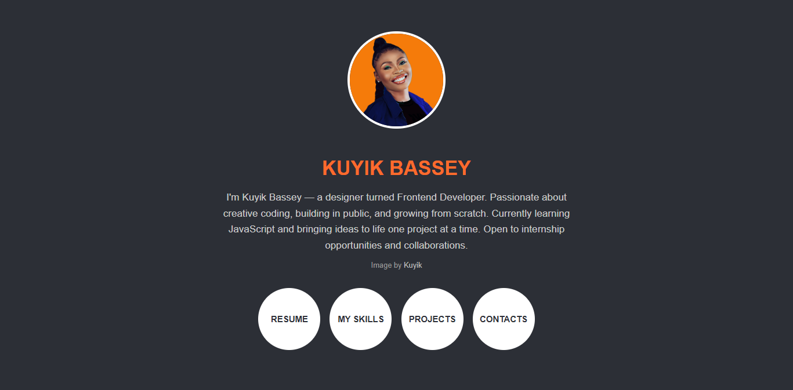

# Responsive Personal Profile Page

This is a simple, mobile-responsive personal profile web page built using **HTML** and **CSS**.

It features a profile image, a short bio, and four circular action buttons: **Resume**, **My Skills**, **Projects**, and **Contacts** — designed to simulate a portfolio landing page for showcasing personal branding.

## 🔧 Tech Stack

- HTML5  
- CSS (Flexbox + Media Queries)

##  Features

- Fully **responsive** layout (mobile-first)
- Centered **profile image** with circular frame
- Bio section with clear **developer intro**
- Four interactive **call-to-action buttons**
- **Dark background** with brand accent colors
- Smooth hover transition on buttons

## 📱 Mobile-Friendly Design

This profile page adapts to smaller screens using media queries, reducing button sizes and font scales for an optimal viewing experience on mobile devices.

## 💡 Author

**Kuyik Bassey** — Designer turned Frontend Developer.  
Learning in public, growing from scratch, and currently exploring JavaScript.

> Open to internship opportunities and collaborations.

## 🔗 Live Preview

You can deploy this project using:
- [GitHub Pages](https://pages.github.com/)

## 📝 License

This project is open for learning and portfolio use. Please credit the author if you use it publicly.

## 🚀 Let's Connect

If you're a developer/designer looking to grow, collaborate, or just say hi — reach out on [LinkedIn](https://www.linkedin.com/in/kuyik_bassey)

